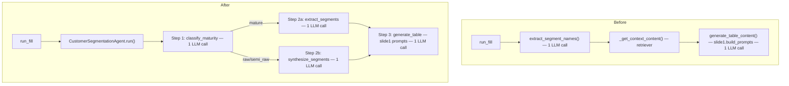

# Customer Segmentation LangChain Agent Upgrade

## Architecture Before vs After




## Files to Change

### 1. NEW — `[backend/generation/customer_segmentation_agent.py](backend/generation/customer_segmentation_agent.py)`

A LangChain LCEL-based agent class with four chains:

- `**_classify_chain**` — classifies the uploaded content as `totally_raw`, `semi_raw`, or `mature`. Uses `ChatPromptTemplate | llm | JsonOutputParser`.
  - **Mature**: file already contains named HCP segments (answers present).
  - **Semi-raw**: some human analysis but segments not clearly named.
  - **Totally raw**: raw interviews / observational notes, no prior analysis.
- `**_extract_chain`** (mature path) — extracts existing segment names directly from the file. Constrained to `2 ≤ count ≤ n_segments`.
- `**_synthesize_chain`** (raw/semi-raw path) — applies the full segmentation guideline (attitudes/beliefs/behaviors/drivers/barriers, no demographics/volume/geography as primary basis) to produce 2–4 mutually exclusive HCP segment names, capped at `n_segments`. The guideline including TRAITS SOURCING RULES is only loaded on this path.
- `**_table_chain`** — generates table content using the exact row-level extraction rules from `slide1.build_prompts()` (imported from `slide_prompts/customer_segmentation/slide1.py` to avoid duplication).

`run()` orchestrator method:

```python
def run(self, content, n_segments, indexes, module, trace_writer=None) -> dict:
    # Step 1
    maturity = self._classify(content)
    # Step 2
    segments = self._extract(content, n_segments) if maturity == "mature" \
               else self._synthesize(content, n_segments)
    # Clamp: 2 ≤ count ≤ n_segments
    segments = segments[:n_segments]
    while len(segments) < MIN_SEGMENTS: segments.append(f"Segment {len(segments)+1}")
    # Step 3
    table_data = self._generate_table(content, segments, indexes)
    return {"segment_names": segments, "table_data": table_data}
```

LangChain client construction reuses existing env vars (`QWEN_API_KEY`, `QWEN_BASE_URL`, `QWEN_MODEL`) and passes through the `httpx.Client` config from `llm_client._build_http_client()`.

---

### 2. MODIFY — `[backend/generation/orchestrator.py](backend/generation/orchestrator.py)`

In `run_fill()`, add a branch **before** the existing query/retrieval/table-generation flow for Customer Segmentation slides:

```python
_is_cs = _normalize_label(module) == "customer segmentation"

if _has_placeholder_columns(placeholder_cols) and not is_ms_slide3 and _is_cs:
    from generation.customer_segmentation_agent import CustomerSegmentationAgent
    full_content = _full_markdown_context(file_ids)
    agent_result = CustomerSegmentationAgent().run(
        content=full_content,
        n_segments=len(placeholder_cols),
        indexes=indexes,
        module=module,
    )
    segment_names = agent_result["segment_names"]
    table_data   = agent_result["table_data"]
    _segment_name_cache[module] = segment_names
    # → skip normal retrieval + generate_table_content path
    # → go directly to trace_persist + cache_update + return
```

Key behavior preserved:

- `_segment_name_cache[module]` is still populated, so CS slide 2 onward reuses cached names via the existing path.
- All trace writing (`_write_fill_trace_file`) and `_slide_table_cache` update are still performed.
- Non-CS modules with placeholder columns still call `extract_segment_names()` unchanged.

---

### 3. MODIFY — `[backend/requirements.txt](backend/requirements.txt)`

Add:

```
langchain>=0.3.0
langchain-openai>=0.3.0
```

---

### 4. Unchanged files (no edits needed)

- `[backend/generation/slide_prompts/customer_segmentation/slide1.py](backend/generation/slide_prompts/customer_segmentation/slide1.py)` — `build_prompts()` remains the canonical table-generation prompt, used by both the new agent (Step 3) and the feedback path in `agent.py`.
- `[backend/generation/segment_extractor.py](backend/generation/segment_extractor.py)` — kept for non-CS modules; bypassed for CS via the orchestrator branch above.
- `[backend/generation/agent.py](backend/generation/agent.py)` — feedback/ask-mode path unchanged; `get_prompt_builder("customer segmentation")` still routes to `slide1.build_prompts`.

